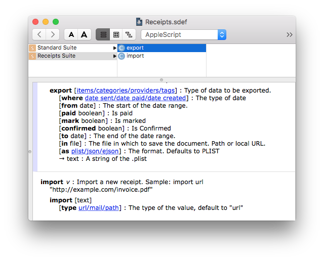

# Import and Export API

It is possible to use [macOS scripting](https://developer.apple.com/library/content/documentation/LanguagesUtilities/Conceptual/MacAutomationScriptingGuide/index.html) features to import or export data into and from Receipts. You can use the programming languages supported by macOS like [AppleScript](https://developer.apple.com/library/content/documentation/AppleScript/Conceptual/AppleScriptLangGuide/introduction/ASLR_intro.html) and [JavaScript](https://developer.apple.com/library/content/releasenotes/InterapplicationCommunication/RN-JavaScriptForAutomation/Articles/OSX10-10.html#//apple_ref/doc/uid/TP40014508-CH109-SW1).

In the Apple's ScriptEditor environment you should make use of the "Library" feature, which shows you the detailed API documentation

On **GitHub** you find examples and documentation: <https://github.com/holtwick/receipts-api>



## Simple Examples

AppleScript:

```applescript
tell application "Receipts"
	set result to export from date "1.1.2017" to current date as plist
end tell
```

Javascript:

```js
var Receipts = new Application("Receipts")
var json = Receipts.export({
	from: new Date(2017,1,1),
	to: new Date(),
	as: 'json'
	})
var result = JSON.parse(json)
```

## Data Structure - API Version 1.0

The following definition is in [Flow syntax for Interface Types](https://flow.org/en/docs/types/interfaces/). 

### Export

```js
interface ReceiptsExport {
    creator: string,            // App name
    creatorVersion: string,     // App version
    apiVersion: string          // Version of this format, currently 1.0
    type: string                // The type of data, usually "receipts"
    id: string,                 // ID identifying the originating database
    items: [ReceiptsItem]
}

interface ReceiptsItem {
    id: string,             // Unique ID

    reference: string,      // The reference to the receipt, usually incremental number
    title: string,          // The title, prefilled with the original file name
    notes: string,          // Personal notes
    text: string,           // The content for full text search

    isConfirmed: boolean,   // Correctness manually confirmed by user
    isPaid: boolean,        // Also see datePayment
    isMarked: boolean,      // In the UI named "starred"
    isCredit: boolean,      // True if revenue, else spending
    
    category: ReceiptsCategory,
    contact: ReceiptsContact,
    tags: [ReceiptsTag],

    date: Date,             // The date of the receipt
    datePayment: Date,      // The date when the payment was performed
    dateAdded: Date,        // The date the item was added to Receipts

    amounts: ReceiptsAmounts,
    // The amounts in the default currency
    amountsOriginal: ReceiptsAmountsOriginal,
    // The amounts in the receipt's currency

    iban: string,           // The IBAN for wire transfer payments

    asset: ReceiptsFile,            // Local file URL pointing to the processed PDF
                                    // i.e. OCR applied, converted to searchable PDF
    assetOriginal: ReceiptsFile     // If available the copy of the source data
    
    exportFileName: string          // Filename used for last export
}

interface ReceiptsCategory {
    id: string,
    title: string,
}

interface ReceiptsContact {
    id: string,
    title: string,
}

interface ReceiptsTag {
    id: string,
    title: string,
}

interface ReceiptsAmounts {
    net: Decimal,
    gross: Decimal,
    tax: Decimal,
    currency: string,
    exchangeRate: Decimal
}

interface ReceiptsAmountsOriginal {
    net: Decimal,
    gross: Decimal,
    tax: Decimal,
    currency: string,
    taxDetails: [ReceiptsTaxDetails]
}

interface ReceiptsTaxDetails {
    percent: Decimal,
    value: Decimal
}

interface ReceiptsFile {
    url: string,
    path: string,
    uti: string,
    ext: string,
    size: number,
    md5: string
}
```

### Import

For import in general the `ReceiptsItem` applies, but for convenience some additional fields are supported:

```js
interface ReceiptsItemImport extends ReceiptsItem {
    category: string | ReceiptsCategory,
    contact: string | ReceiptsContact,
    tags: [string | ReceiptsTag],
}
```

### Notes

For **plist** format the following conversions apply:

- `Decimal` => `<string>` (In ObjC you should use NSDecimalNumber)
- `URL` => `<string>`

For **json** format the following conversions apply:

- `Decimal` => `string` (In JS we recommend [decimal.js](https://github.com/MikeMcl/decimal.js))
- `Date` => `string` ([ISO 8601](https://en.wikipedia.org/wiki/ISO_8601), which is compatible to JS [`Date` "ISO" methods](https://developer.mozilla.org/en-US/docs/Web/JavaScript/Reference/Global_Objects/Date))

#### Clipboard / Pasteboard

The **plist** format described before is also used in the clipboard as type `com.apperdeck.receipts.pasteboard.3`.

<link href="/css/zenburn.css" type="text/css">
